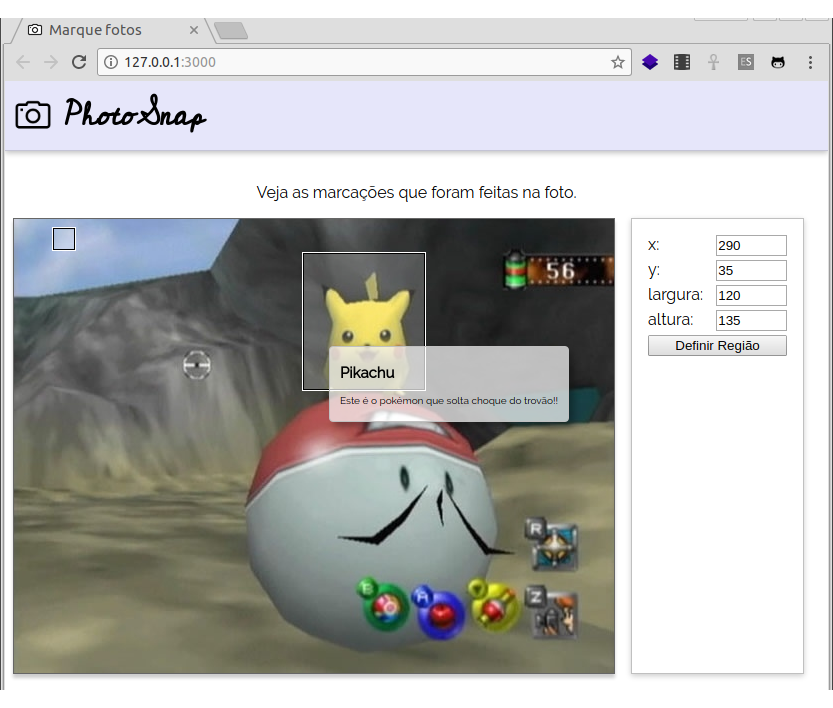

# P~~oké~~hotoSnap

Uma ferramenta para marcar suas fotos!



## Atividade

Você deve modificar a página para que ela mostre duas marcações (~~pokémons~~) na imagem (~~foto~~). Cada marcação é definida por uma região retangular que começa do canto superior esquerdo (é o `(0, 0)`) e possui um título e um conteúdo, que devem ser exibidos em um balãozinho quando o usuário passar o mouse sobre cada uma.

### Exercício 1: Alterar/remover conteúdo do balãozinho

Crie um código JavaScript (_e.g._, `balaozinho.js`) que, para cada região anotada (`.regiao-anotada`, cada quadradinho dentro da imagem), define o conteúdo do elemento `#balaozinho` (lembre-se [como definir o conteúdo de um elemento HTML][inner-html]) com uma string qualquer.

Você deve atrelar os devidos eventos de mouse **a cada¹** `.regiao-anotada` para que:

1. quando o **mouse entrar no quadradinho**, definir o conteúdo do `#balaozinho` como uma string qualquer
1. quando o **mouse sair do quadradinho**, definir o conteúdo como uma string vazia

¹ No momento existem duas `.regiao-anotada`s, mas pode ser que existam muitas outras, ou até nenhuma. Como [selecionar vários elementos do DOM][selecionar-varios]?

### Exercício 2: Definir título/conteúdo correto do balãozinho

Agora, você deve substituir a "string qualquer" com um trecho HTML que contenha o título e o conteúdo da região anotada, tipo assim:

```html
<div class="balaozinho">  
  <h2>título da anotação</h2>
  <p>conteúdo da anotação</p>
</div>
```

Cada `.regiao-anotada` é uma `<div></div>` devidamente estilizada e ela está assim:

```html
<div class="regiao-anotada"
  data-titulo="Electrode"
  data-conteudo="Este é uma pseudo-pokébola invertida"
  style="width: 20px; height: 20px; top: 10px; left: 40px;"></div>
```

Elas possuem dois atributos "personalizados": um deles chama `data-titulo="..."` e armazena o título daquela região marcada e o outro chama `data-conteudo="..."` e armazena o texto que deve ir dentro do parágrafo do balãozinho.

Na verdade, nós podemos usar atributos que não existem no HTML para nossos próprios propósitos. Basta colocar `data-novoatributo` em um elemento (_data_ em inglês = dados em português).

Para acessar o valor desses atributos, usamos uma propriedade `dataset` do elemento HTML, assim:

```html
<span data-dikentinha="um texto">Algum assunto</span>
```
```js
let algumEl = document.querySelector('....');
console.log(algumEl.dataset.dikentinha);
// imprime "um texto" no console
```

### Exercício 3: Formatação do balãozinho

Estilize o `#balaozinho` para que ele se pareça com um balãozinho mesmo. Sugestões:

- Tamanho de fonte menor (tipo `10px`)
- Cor de fundo semitransparente
- Bordinha marota
- Um espacinho interno (`padding`)
- Cantinho levemente arredondado
- Uma sombra sinistra (veja FAQ)

Além disso, faça com que o mouse fique com o `cursor` de `help` (mostra uma interrogação em vez da setinha) quando em uma `.regiao-anotada`.

### Exercício 4: Posicionamento do balãozinho

Faça com que, quando o mouse se movimente dentro de uma `.regiao-anotada`, o `#balaozinho` se posicione nas mesmas coordenadas que o mouse. Veja como [pegar a posição do mouse][posicao-mouse] nos slides.

Se acontecer do balãozinho ficar "piscando" ao mexer o mouse, veja o FAQ sobre como consertar.

### Exercício 5: Definição da 1ª marcação

Faça com que o usuário possa definir as propriedades da 1ª região anotada (`left, top, width, height`) a partir dos campos `input` à direita.

Quando o botão for clicado, as propriedades da 1ª região devem ser atualizadas.

Como um mimo para os olhos do usuário, você pode colocar, em CSS, a propriedade `transition: all 200ms ease` na `.regiao-anotada` para que os valores alterdos das propriedades façam uma transição suave (fica show).

### Desafio 1: Atualização mais ágil da marcação

Em vez de usar o botão para atualizar as propriedades da região anotada, faça com que assim que o usuário pressionar uma tecla em qualquer dos `input`s, a região seja atualizada. Aí você pode até tirar o botão do HTML.

Isso pode ser feito com o evento `keyup` (ainda não vimos) que pode ser associado a um `input`.

### Desafio 2: Definição da marcação sendo editada

Faça com que, em vez de poder alterar apenas a 1ª região anotada, o usuário possa escolher qual delas quer atualizar.

### Desafio 3: Escolha da imagem (_hardcore!_ :bomb:)

Existe um `<input type="file">` que permite ao usuário escolher um arquivo de seu computador. Você pode colocar um desses na página e, assim que o usuário alterar valor desse `input` (evento `change`), seu código altera a imagem que está sendo anotada.

Referência: https://www.html5rocks.com/en/tutorials/file/dndfiles/

## FAQ

### Balãozinho piscando quando movimento o mouse

Pode acontecer de o balãozinho ficar "piscando" quando você movimenta o mouse em cima da região anotada. Isso acontece porque o navegador entende que ora o mouse está em cima da região anotada, ora ele está em cima do balãozinho - e isso alterna muitas vezes por segundo.

Uma forma de evitar isso é posicionar o balãozinho a uma certa distância do mouse, em vez de exatamente na posição dele. Outra forma é falar que a `<div id="balaozinho">...</div>` não "responde" a eventos de mouse. É possível fazer isso bem facilmente com uma propriedade CSS no `#balaozinho`: `pointer-events: none`.

### Como altero uma propriedade CSS de um elemento dinamicamente?

Há 2 formas, sendo uma delas colocando e tirando classes, e a outra [alterando a propriedades CSS diretamente](https://fegemo.github.io/cefet-front-end/classes/js3/#estilizando-elementos-dinamicamente).


### Como fazer sombras em CSS?

Existe a propriedade `box-shadow`. Ela funciona assim:

```css
div {
  box-shadow: 4px 4px 4px silver;
}
```

O primeiro valor é o deslocamento horizontal da sombra (positivo vai para a direita), o segundo é o vertical (positivo vai para baixo), o terceiro é o quanto a sombra está "borrada" (para uma borda suave, coloque algo diferente de `0`) e o quarto é a cor da sombra.

A cor da sombra, tipicamente, colocamos uma cor semitransparente (_e.g._, `rgba(...., 0.2)`).


[inner-html]: https://fegemo.github.io/cefet-front-end/classes/js2/#alterando-o-conteudo
[selecionar-varios]: https://fegemo.github.io/cefet-front-end/classes/js2/#selecionando-varios-elementos
[posicao-mouse]: https://fegemo.github.io/cefet-front-end/classes/js3/#posicao-mouse
